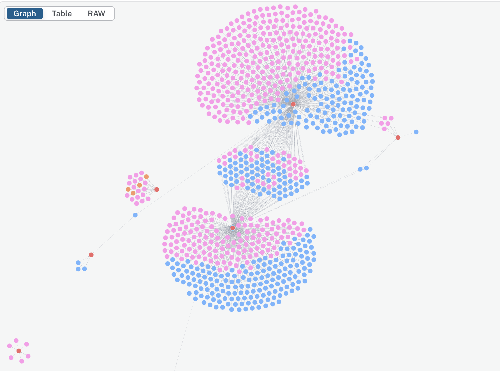
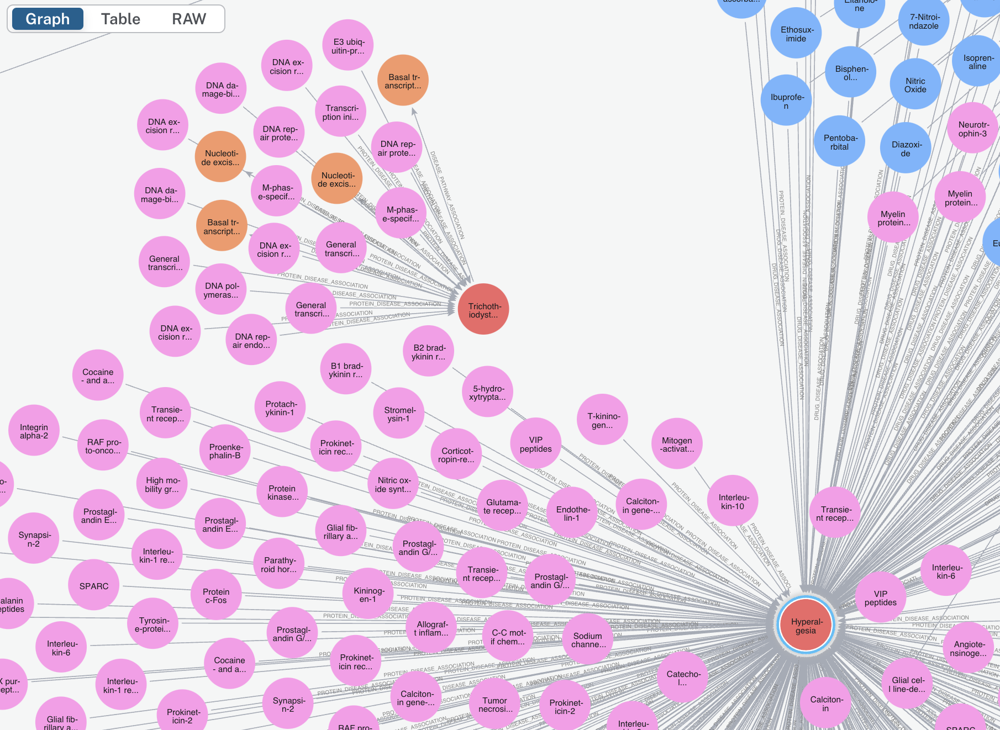

# MolecuLead

**MolecuLead** is a Bio Knowledge Graph (BioKG) combined with a Language Learning Model (LLM) that incorporates graph-based Retrieval-Augmented Generation (graphRAG) capabilities. The project integrates textual knowledge from four major bio databases: UniProt, DrugBank, MeSH (PubMed), and KEGG, enriching the BioKG with textual information to support tasks like molecular lead finding, drug repositioning, and drug repurposing.

The application allows users to query molecular entities and relationships associated with diseases like Nephritis, Nerve Degenration or Hyperalgesia. MolecuLead quickly identifies related molecules, provides summarizations, and cites relevant sources, making it a powerful tool for drug discovery research.


### Graph Data - Neo4j
<p align="center">
  
  
</p>

<p align="center">
  <strong>Protein: Pink, Drugs: Blue, Disease: Red, Pathway: Orange</strong>
</p>

---

## Project Structure

### `/app`

- `__init__.py`: Initializes the module.
- `agent.py`: Placeholder for future modular agent logic.
- `server.py`: Implements the LangServe/FastAPI routing logic, setting up the API endpoints and exposing the application port.

### `/data`

- `/sagemaker_documentation`: Contains processed data used by the application.
- `data_drugs.py`: Script for scraping DrugBank to gather additional drug information.
- `data_proteins.py`: Script for scraping UniProt for protein data.
- `data_pathway.py`: Script for scraping KEGG for pathway data.
- `data_diseases.py`: Script for scraping MeSH for disease-related data.
- `data_upload.py`: Processes and uploads data as a collection to Neo4j.
- `kg.csv`: CSV file containing entities and relationships from the BioKG benchmark dataset.
- Pickle file outputs: Stores serialized objects from data scraping and processing.

### `/frontend_demo`

- Example frontend code that integrates with the LangServe backend APIs, demonstrating how to interact with the MoleculeAD service.

### `/packages`

- Contains additional packages and dependencies utilized by the project.

### `/images`

- Includes images used in the repository for documentation or UI purposes.

### `Dockerfile`

- Defines the instructions to build the Docker image for MoleculeAD, including installation of Python dependencies and Node.js for the frontend.

### `poetry.lock` & `pyproject.toml`

- Poetry configuration files for managing Python dependencies and packages.

### `.gitignore`

- Specifies files and directories to be excluded from version control, ensuring unnecessary or sensitive files are not tracked by Git.

---

## Setup Instructions

### Prerequisites

To run MoleculeAD locally or in a Docker container, ensure you have the following:

- **Docker**: Download and install from [Docker Hub](https://hub.docker.com/).
- **Python 3.11 or higher**
- **Poetry**: For Python dependency management. Install it by following the instructions on [Poetry's website](https://python-poetry.org/docs/#installation).

---

## Quickstart: Docker

This Quickstart guide will help you get MoleculeAD running quickly using Docker.

### Step 1: Pull the Docker Image

Pull the latest version of the MoleculeAD Docker image from Docker Hub using the following command:

```bash
docker pull seangorman117/moleculead:initial
```

### Step 2: Run the Docker Container

Run the Docker container, mapping the appropriate ports for the frontend (4444) and backend (8000):

```bash
docker run -p 4444:4444 -p 8000:8000 seangorman117/moleculead:initial
```

### Step 3: Access the Application

Once the Docker container is running, open your web browser and navigate to:

- [http://localhost:4444](http://localhost:4444) to access the frontend.
- [http://localhost:8000](http://localhost:8000) for the backend API.

---

## Additional Information

MoleculeAD is built to handle complex queries about molecular interactions, drug repurposing, and disease associations using its Bio Knowledge Graph enhanced with relevant textual data. It is highly modular and can be extended with additional data sources or agents, making it a flexible tool for researchers in bioinformatics, drug discovery, and related fields.
